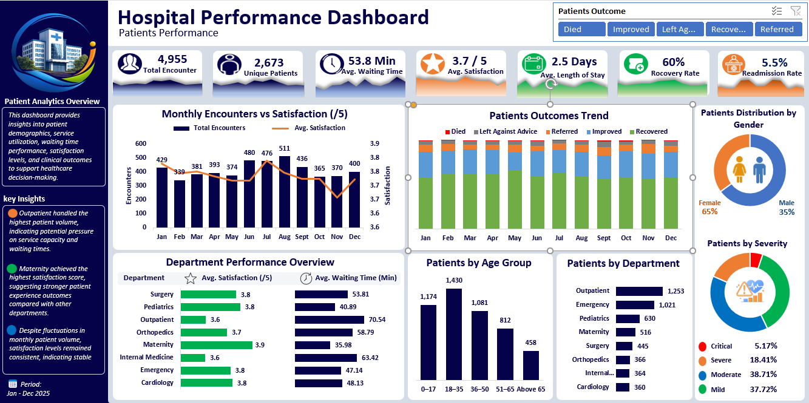
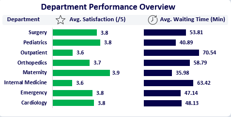
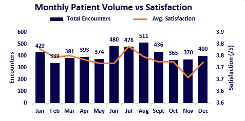
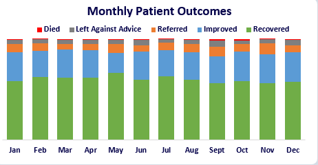

# Hospital Patient Analytics Dashboard

## Analysing Patient Volume, Service Efficiency, Satisfaction and Clinical Outcomes Using Excel

## Project Overview

This project analyses hospital patient encounter data to identify patterns in patient volume, patient demographics, service efficiency, patient satisfaction, and clinical outcomes.

The project demonstrates an end-to-end Excel analytics workflow, including data cleaning, exploratory analysis, KPI development, dashboard creation, and business insight generation.

---

# Business Problem

Healthcare organisations need reliable information about patient demand, operational efficiency, and patient experience to make informed decisions.

This analysis was designed to answer key questions such as:

- How many patient encounters occurred during the period analysed?
- Which departments handled the highest patient volumes?
- Which departments experienced longer waiting times?
- How does waiting time relate to patient satisfaction?
- What are the most common patient outcomes?
- How are patients distributed across demographic groups?
- What operational areas may require further attention?

---

# Dataset Overview

The dataset contains hospital patient encounter records with information relating to:

- Patient demographics
- Department information
- Admission details
- Waiting time
- Length of stay
- Satisfaction scores
- Patient outcomes
- Readmission information

### Key Metrics

| Metric | Value |
|---|---:|
| Total Encounters | 4,955 |
| Unique Patients | 2,673 |
| Average Waiting Time | 53.8 minutes |
| Average Satisfaction Score | 3.7 / 5 |
| Average Length of Stay | 2.5 days |
| Recovery Rate | 60% |
| Readmission Rate | 5.5% |

---

# Data Cleaning and Preparation

Before analysis, the dataset was reviewed and prepared to improve data quality and consistency.

The cleaning process included:

- Reviewing duplicate records
- Assessing missing values
- Validating date fields
- Checking inconsistent date entries
- Reviewing patient and encounter identifiers
- Standardising analytical categories
- Creating calculated metrics required for analysis

Missing values were assessed carefully and were not replaced with fabricated information where doing so could affect the accuracy of the analysis.

---

# Tools Used

| Tool | Purpose |
|---|---|
| Microsoft Excel | Data cleaning, analysis and dashboard development |
| PivotTables | Data summarisation and exploration |
| PivotCharts | Data visualization |
| Slicers | Interactive filtering |
| Excel Formulas | Calculated metrics and KPI development |

---

# Dashboard Features

The final dashboard provides insights into:

## Patient Overview

- Total encounters
- Unique patients
- Average waiting time
- Average satisfaction
- Average length of stay
- Recovery rate
- Readmission rate

## Operational Analysis

- Monthly patient volume trends
- Patient outcomes over time
- Department performance comparison
- Waiting time and satisfaction analysis

## Patient Demographics

- Age distribution
- Gender distribution
- Patient severity classification

---

# Key Insights

## Department Performance Analysis

This analysis compares departments based on patient satisfaction and average waiting time to identify areas requiring operational attention.

## 1. Outpatient Service Demand

Outpatient recorded the highest patient volume, indicating potential pressure on service capacity and waiting-time management.

## 2. Patient Satisfaction Performance

Maternity achieved the highest average satisfaction score among the departments analysed.

## 3. Waiting Time and Patient Experience

Departments with longer average waiting times showed lower satisfaction scores, highlighting waiting time as an important area for operational improvement.

## 4. Monthly Trends

Patient volume varied throughout the year, while overall satisfaction remained relatively stable.

## 5. Patient Outcomes

This visualization highlights changes in patient outcomes across months and shows the distribution of recovery and other outcomes.

Recovery was the dominant patient outcome category throughout the analysed period.

---

# Recommendations

Based on the analysis:

- Review outpatient capacity planning during high-demand periods.
- Investigate factors contributing to longer waiting times in affected departments.
- Identify service practices from high-performing departments that may improve patient experience elsewhere.
- Continue monitoring patient satisfaction alongside patient volume.
- Track readmission and outcome trends as part of ongoing performance evaluation.

---

# Project Limitations

Some records contained missing date information. Therefore, date-based analysis was interpreted using available valid date records.

The analysis identifies patterns and relationships within the dataset but does not establish causal relationships between variables.

---

# Project Outcome

This project demonstrates an end-to-end data analytics workflow:

**Raw Data → Data Cleaning → Data Validation → Exploratory Analysis → KPI Development → Dashboard Creation → Insights → Recommendations**

---

# Future Improvements

Future development of this project will include rebuilding the dashboard in Power BI to introduce:

- Advanced filtering
- Improved date modelling
- Interactive reporting
- Additional analytical capabilities

---

## Author

**George Blessing**

Data Analyst | Excel • SQL • Power BI • Python
